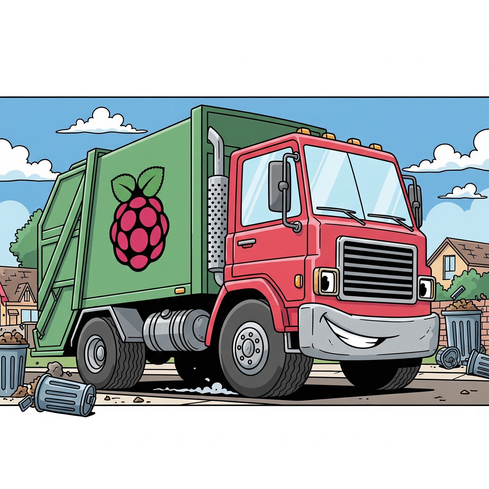

# Waste Classification AI on Raspberry Pi (Overkill AI Series #1)

  

This repository documents the evolution of a personal project focused on building an AI-powered waste classification system using a **Raspberry Pi**. The goal is to capture an image of a waste item with a connected camera, send it to a trained AI model, and receive a classification of the item as **rubbish, organics, recyclable, or ecodrop**.

This is a work-in-progress, and I'll be adding more information as the project evolves. I enjoy tinkering with technology, and this project is a way for me to explore the intersection of hardware, machine learning, and something that is useful for the environment.

-----

## Project Phases

This project is broken down into several phases, each with its own folder and a detailed `README.md` file. You can follow the development process by exploring these individual phases.

### 1\. Phase 1: Base Pi Work

The initial phase, located in the `phase1_base_pi_work` folder, covers the foundational setup. This phase serves as the fundamental starting point for the entire project. This stage focuses on the core tasks of getting the Raspberry Pi, its camera, and any other essential peripherals to work together seamlessly.

  * **[Link to Phase 1 README](/phase1_base_pi_work/README.md)**

### 2\. Phase 2: Connecting with Local Vision LLM (+ Prompt Engineering) (in progress)

The next phase, located in the `phase2_connect_llm` folder, this phase represents the first major leap from a simple image capture system to an intelligent classifier by leveraging artificial intelligence for classification. The core idea is to send the captured image to a local Vision LLM (Large Language Model), which is an AI model capable of understanding and processing both text and images.

  * **[Link to Phase 2 README](/phase2_connect_llm/README.md)**

### 3\. Phase 3: Optimizing the result by using RAG (Retrieval Augmented Generation) in local vector database (next)

The next phase, located in the `phase3_rag_evolution` folder, covers getting more accurate data by utilizing RAG by having a local knowledge base that stored inside vector database. Building on the foundation of Phase 2, this phase aims to address the potential inaccuracies and hallucinations of a generic Vision LLM. While a vision LLM can "see" and "describe" an image, it may lack the specific, nuanced knowledge required for precise waste classification. For example, it might not know the local recycling rules or the difference between two similar-looking items. So I'll be retrieving the knowledge from the local [city waste management website](https://ccc.govt.nz/services/rubbish-and-recycling/lookupitem).

  * **[Link to Phase 3 README](/phase3_rag_evolution/README.md)**

## License

This project is licensed under the **MIT License**.

Copyright (c) [2025] [Anova Fawzi]

Permission is hereby granted, free of charge, to any person obtaining a copy of this software and associated documentation files (the "Software"), to deal in the Software without restriction, including without limitation the rights to use, copy, modify, merge, publish, distribute, sublicense, and/or sell copies of the Software, and to permit persons to whom the Software is furnished to do so, subject to the following conditions:

The above copyright notice and this permission notice shall be included in all copies or substantial portions of the Software.

THE SOFTWARE IS PROVIDED "AS IS", WITHOUT WARRANTY OF ANY KIND, EXPRESS OR IMPLIED, INCLUDING BUT NOT LIMITED TO THE WARRANTIES OF MERCHANTABILITY, FITNESS FOR A PARTICULAR PURPOSE AND NONINFRINGEMENT. IN NO EVENT SHALL THE AUTHORS OR COPYRIGHT HOLDERS BE LIABLE FOR ANY CLAIM, DAMAGES OR OTHER LIABILITY, WHETHER IN AN ACTION OF CONTRACT, TORT OR OTHERWISE, ARISING FROM, OUT OF OR IN CONNECTION WITH THE SOFTWARE OR THE USE OR OTHER DEALINGS IN THE SOFTWARE.