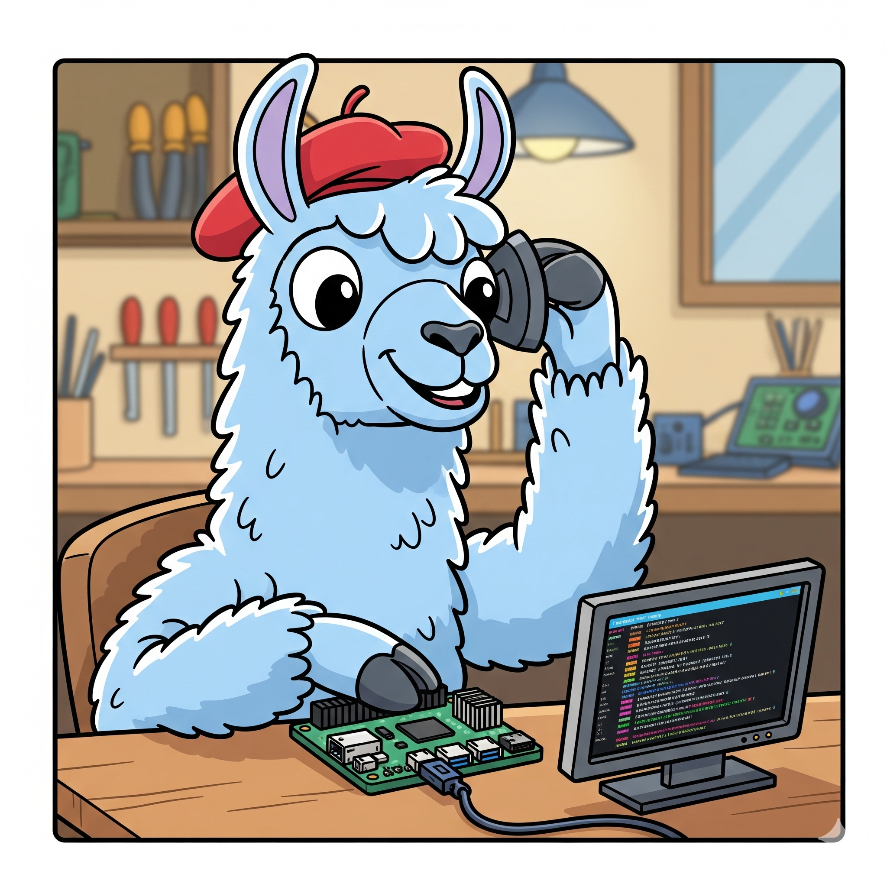
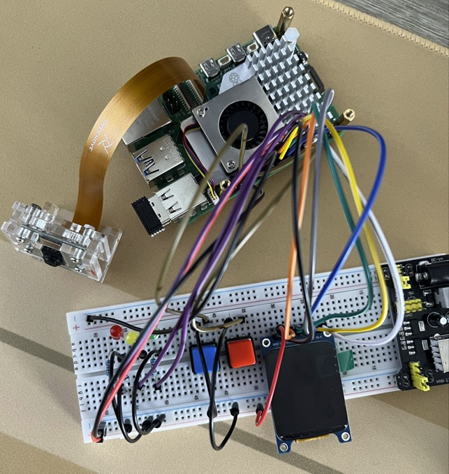

# Phase 1: Base Pi Work

This directory contains the initial code and documentation for setting up the Raspberry Pi and its peripherals. The main objective of this phase is to establish a working environment for image capture, which is the foundational step for our AI waste classification project.

  

-----

## Components and Pinout

This project utilizes a variety of components connected to a Raspberry Pi to function as a visual classifier. The following list details the hardware used, along with the specific GPIO pin configurations for each.

  

### Components

* **Four LEDs**:
    * One **Red** LED (showing "Rubbish" category)
    * One **Yellow** LED (showing "Recyclable" category)
    * One **Green** LED (showing "Organics" category)
    * One **Blue** LED (showing "EcoDrop" category)
* **Two Push Buttons**:
    * One for starting/stopping the camera feed.
    * One for capturing a photo.
* **One ST7789 LCD Module**: A 320x240 pixel display used for showing the camera feed and other information.
* **One Standard Raspberry Pi Camera Module**: The primary sensor for capturing waste images.

### Pin Configuration

The components are connected to the Raspberry Pi's GPIO pins as follows:

**ST7789 LCD Module (SPI Interface)**

* **SCLK**: GPIO11
* **MOSI**: GPIO10
* **DC**: GPIO25
* **RST**: GPIO24
* **CS**: GPIO8
* **BLK**: GPIO23
* **GND**: Any Ground pin
* **VCC**: Any 3.3v pin

**LED Pins**

* **RED_LED_PIN**: GPIO22
* **YELLOW_LED_PIN**: GPIO27
* **GREEN_LED_PIN**: GPIO17
* **BLUE_LED_PIN**: GPIO6

**Button Pins**

* **START_BUTTON_PIN**: GPIO16 (Button for starting/stopping camera feed)
* **CAPTURE_BUTTON_PIN**: GPIO26 (Button for capturing a photo)

**Raspberry Pi Camera**

* The camera module is connected to **Camera Port 0 (CAM 0)** on the Raspberry Pi.

## Source Code

The primary Python script for this phase is `takepicrpicam.py`. This script handles the following functionalities:

  - Initializing and controlling the Raspberry Pi camera module.
  - Taking a picture with the camera.
  - Controlling LEDs to provide visual feedback during the process (e.g., indicating when a picture is being taken).

You can find the main documentation for the whole project [here](/README.md).