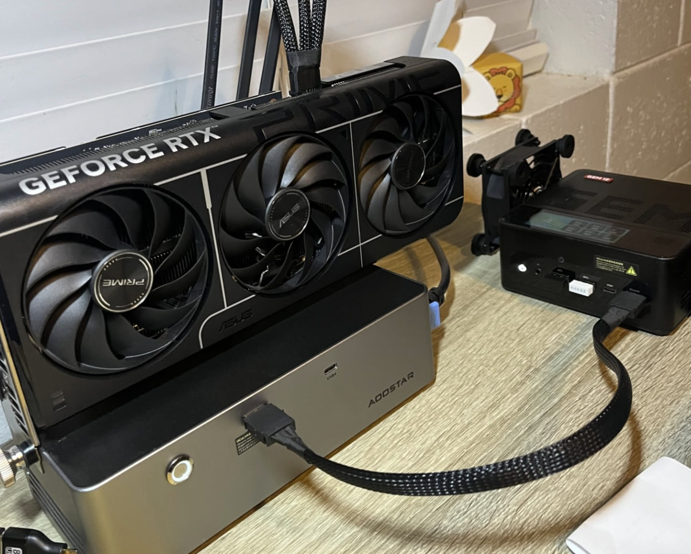

# Phase 2: Connecting with Local Vision LLM (+ Prompt Engineering) (in progress)

This directory contains the integration part with the Vision LLM. The main objective of this phase is to establish a working communication between the Raspberry Pi and the LLM.

<div align="center">
  
</div>

The primary challenge in this phase is not just connecting to the model but also effectively communicating with it. This is where Prompt Engineering becomes critical. Instead of just sending the image, you craft a specific and detailed prompt to guide the AI's response. For example, a basic prompt might be "What is in this picture?", while a more engineered prompt would be "Analyze the object in this image. Is it 'rubbish', 'organics', 'recyclable', or 'ecodrop'? Respond with only one of those four categories." This process of refining the prompt helps to get a more accurate and structured output from the model, even with a basic setup.

This phase is about exploring the capabilities and limitations of a generic, pre-trained Vision LLM for a specific classification task and learning how to influence its output through careful instruction.

## Vision Model

This project utilizes Qwen2.5-VL-7B from [ollama](https://ollama.com/library/qwen2.5vl:7b), as this model is very capable on handling vision tasks but small enough to be hosted in local environment.

### Inference Setup

As the Raspberry Pi 5 itself won't be enough to run this model. I will do the inference on my other desktop computer, and the Raspberry Pi will request to this as it is connected on the same network.

<div align="center">
  
</div>

### Components

* **Raspberry Pi**: Raspberry Pi 5 8 GB
* **Inference Machine**: 
    * Aoostar GEM12 Pro Mini PC with 64 GB of RAM
    * ASUS Prime Nvidia RTX 5070 Ti 16 GB connected through Oculink (yep, overkill, yep)
    * Aoostar GPU Dock

## Source Code

The primary Python script for this phase is `llm_processor.py`. This script handles the following functionalities:

  - Receive a base64 image from the Raspberry Pi
  - Do prompt calling to the Vision LLM.
  - Analyze the result from LLM, make some adjustment if needed.
  - Return in Json format back so the Raspberry Pi could easily interpret it to light up the correct LED color or no LED color at all if waste cannot be categorized.
  ```json
    {
      "waste_category": "Rubbish",
      "waste_name": "Soft plastic",
      "waste_type": 1
    }
  ```
  ```json
    {
      "waste_category": "Recyclable",
      "waste_name": "Egg container",
      "waste_type": 2
    }
  ```
  ```json
    {
      "waste_category": "Organics",
      "waste_name": "Banana peel",
      "waste_type": 3
    }
  ```
  ```json
    {
      "waste_category": "EcoWaste",
      "waste_name": "Battery waste",
      "waste_type": 4
    }
  ```

With the result retrieved from the Vision LLM, the `takepicrpicam.py` from the phase 1 will now be updated to `waste_rpi_processor.py`. This script will now do:
  - Showing the result on the TFT LCD
  - Turn on the appropriate LED color based on it's waste type ```rubbish = red, organics = green, recyclable = yellow, or ecodrop = blue```

You can find the main documentation for the whole project [here](/README.md).