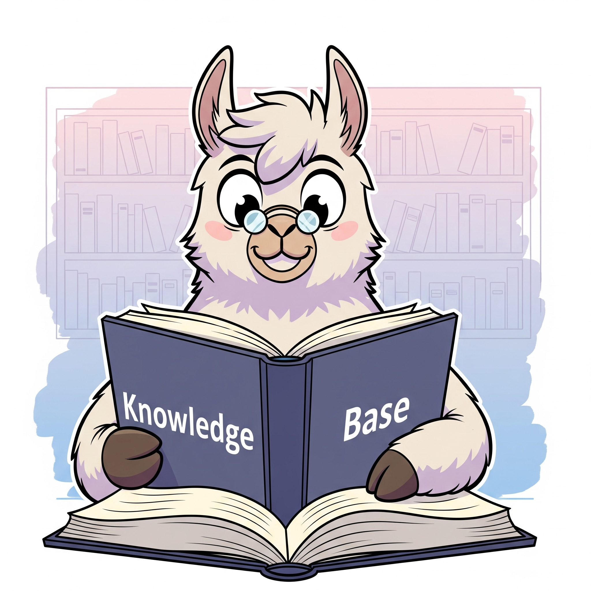

# Phase 3: Optimizing the result by using RAG (Retrieval Augmented Generation) in local vector database (next to do)

This directory contains the optimization of the result using RAG. The RAG system works by giving the AI access to a private, curated knowledge base. In this project, this knowledge base would contain specific information about waste items, their categories, and perhaps local rules. 

  

This information is stored and indexed efficiently in a local Vector Database. When a new image is captured, the system first retrieves the most relevant information from this database (the "Retrieval" part) and then sends both the image and this retrieved information to the Vision LLM.

This process essentially "augments" the AI's general knowledge with specific, accurate data, leading to a much more reliable and context-aware classification. This phase is crucial for moving from a "best guess" system to a more dependable and accurate classifier.

You can find the main documentation for the whole project [here](/README.md).